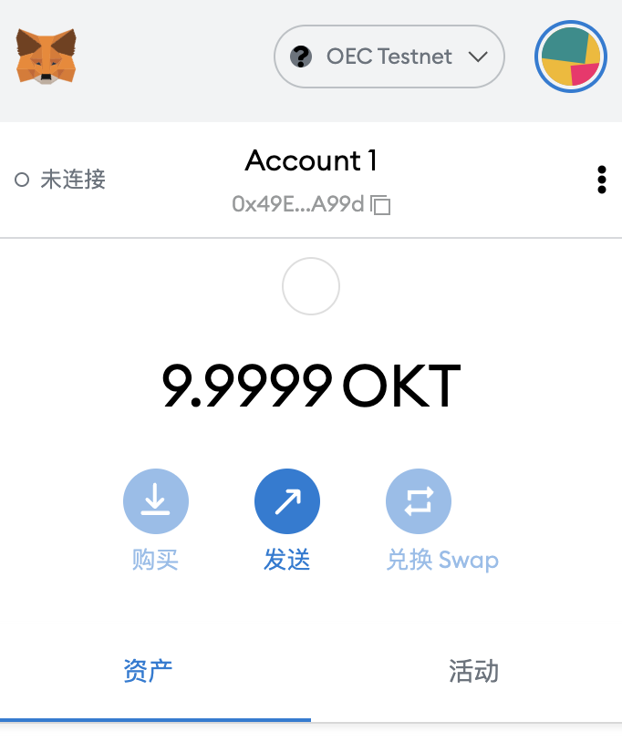
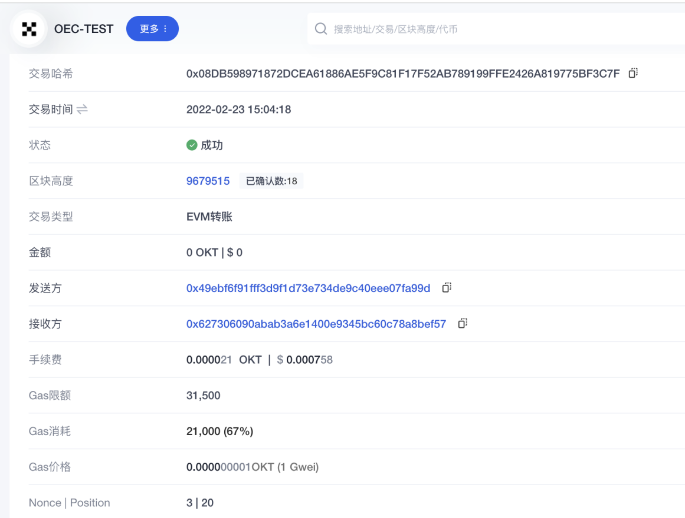
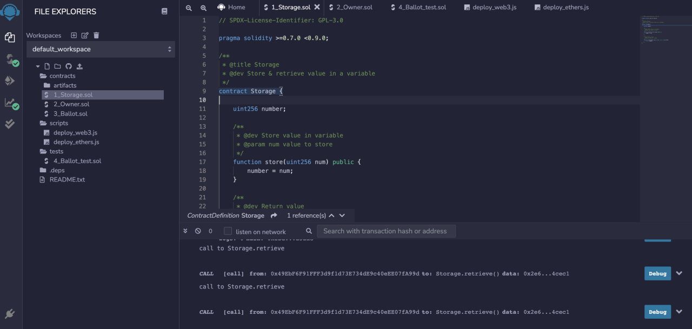
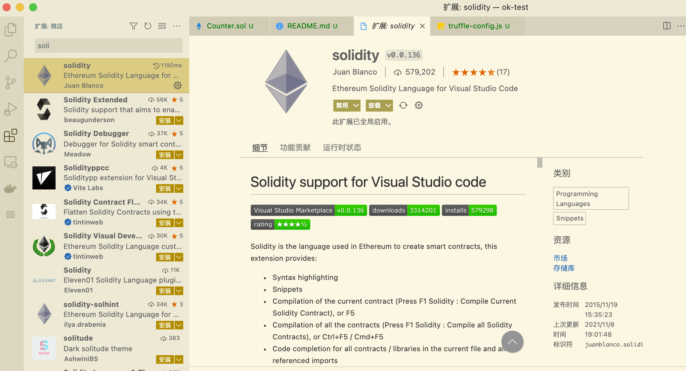
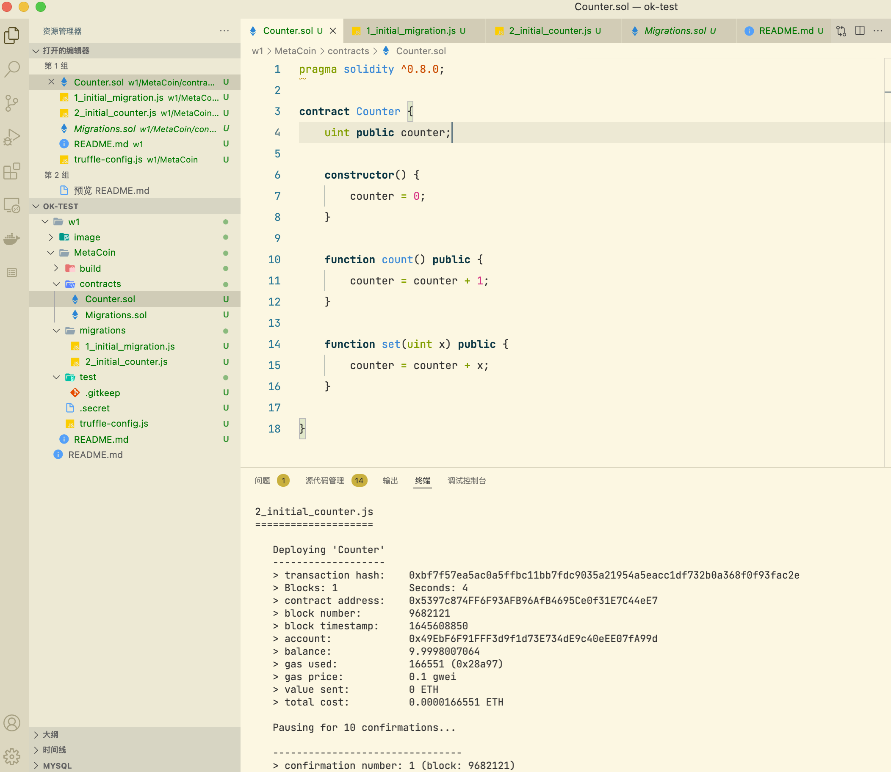
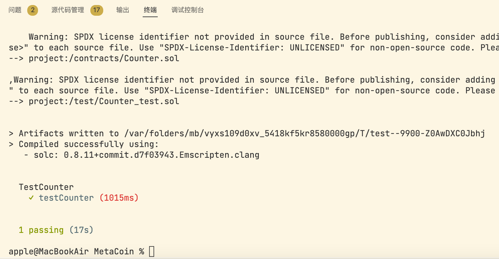

# W-1-1
## 1、安装 Metamask、并创建好账号

## 2、执行一次转账
https://www.oklink.com/zh-cn/oec-test/tx/0x08db598971872dcea61886ae5f9c81f17f52ab789199ffe2426a819775bf3c7f

## 3、使用 Remix 创建任意一个合约

## 4、VSCode IDE 开发环境配置

## 5、使用 Truffle 部署 Counter 合约 到 test 网络（goerli）（提交交易 hash）

## 6、编写一个测试用例
