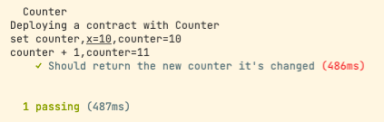

# w1-2
## 使用Hardhat部署修改后的Counter
```js
// SPDX-License-Identifier: GPL-3.0
pragma solidity ^0.8.0;
import "hardhat/console.sol";

contract Counter {
    uint public counter;

    constructor() {
        console.log("Deploying a contract with Counter");
        counter = 0;
    }

    function get() public view returns(uint) {
        return counter;
    }

    function count() public {
        counter = counter + 1;
        console.log("counter + 1,counter=%s", counter);
    }

    function set(uint x) public {
        counter = counter + x;
        console.log("set counter,x=%s,counter=%s", x, counter);
    }

}
```
## 使用Hardhat测试Counter
```js
const { expect } = require("chai");
const { ethers } = require("hardhat");

describe("Counter", function () {
  it("Should return the new counter it's changed", async function () {
    const counterFactory = await ethers.getContractFactory("Counter");
    const counter = await counterFactory.deploy();
    await counter.deployed();

    const setCounterTx = await counter.set(10);
    await setCounterTx.wait();
    expect(await counter.get()).to.equal(10);
    
    const countTx = await counter.count();
    await countTx.wait();
    expect(await counter.get()).to.equal(11);
  });
});
```
测试结果：  

## 写一个脚本调用count()
